<h3><code>matis@github ~ $ ./contributions.sh</code></h3>

  

<h3><code>matis@github ~ $ neofetch</code></h3>
<table>
  <tr>
    <td valign="top"></td>
    <td valign="top"></td>
  </tr>
</table>

 

<a href="https://fluxaweb.fr"><code>fluxaweb.fr</code></a>
&nbsp;·&nbsp;
<a href="https://www.linkedin.com/in/matis-geneix-4840012a5"><code>linkedin</code></a>

